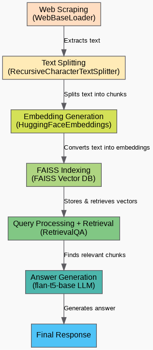
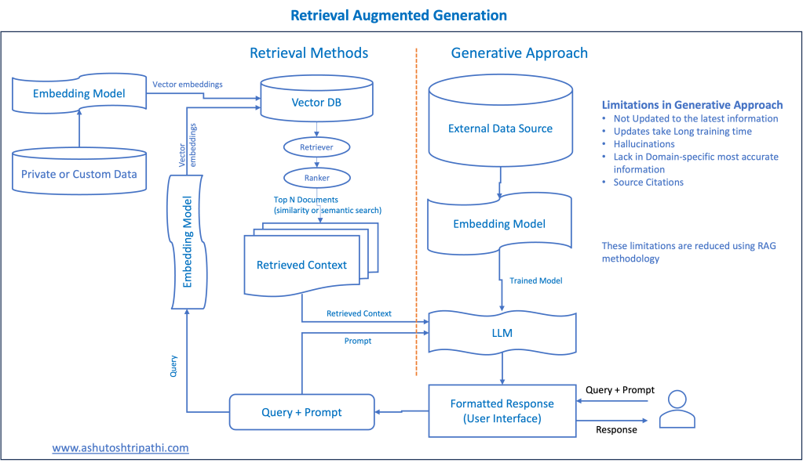

<h2>
NewsRAG: AI Powered News Retrieval and Q & A System
</h2>

          

<h2>Project Workflow</h2>

<h3>1. Web Scraping (WebBaseLoader): Extracts raw text from URLs</h3>
<pre>
from langchain_community.document_loaders import WebBaseLoader
</pre>
<ul>
  <li>The <strong>WebBaseLoader</strong> class loads web pages from the given URLs.</li>
  <li>The <code>load()</code> function fetches the HTML content and extracts text from these web pages.</li>
  <li>The extracted text is stored in <code>data</code>, which is a list of Document objects.</li>
</ul>

<h3>2. Text Splitting (RecursiveCharacterTextSplitter): Chunks large documents for efficient processing</h3>
<pre>
from langchain.text_splitter import RecursiveCharacterTextSplitter
</pre>
<ul>
  <li>Large documents need to be split into smaller chunks for efficient search and retrieval.</li>
  <li>The <strong>RecursiveCharacterTextSplitter</strong>:
    <ul>
      <li>Splits text into chunks of 1,000 characters.</li>
      <li>Ensures overlapping for better context retention.</li>
    </ul>
  </li>
</ul>

<h3>3. Embedding Generation (HuggingFaceEmbeddings): Converts text into vector embeddings</h3>
<pre>
from langchain.embeddings import HuggingFaceEmbeddings
</pre>
<ul>
  <li>Uses <strong>Sentence-BERT (SBERT)</strong>, specifically <code>all-MiniLM-L6-v2</code>, to convert text into numerical embeddings (vectors).</li>
  <li><strong>Why embeddings?</strong>
    <ul>
      <li>They capture the meaning of words and sentences.</li>
      <li>Enable semantic search and similarity-based retrieval.</li>
    </ul>
  </li>
</ul>

<h3>4. FAISS Indexing: Stores embeddings in a FAISS vector database</h3>
<pre>
FAISS.from_documents(docs, embedding_model)
</pre>
<ul>
  <li><strong>FAISS (Facebook AI Similarity Search)</strong> is a library for efficient similarity search in high-dimensional vector spaces.</li>
  <li>Converts document chunks into vectors.</li>
  <li>Stores them in a FAISS index for fast retrieval.</li>
</ul>

<h3>5. Query Processing + Answer Generation: Retrieves relevant document chunks + generates answers</h3>
<pre>
from langchain.chains import RetrievalQA
</pre>
<ul>
  <li><strong>RetrievalQA</strong> creates a Retrieval-Augmented Generation (RAG) pipeline.</li>
  <li><code>vector_index.as_retriever()</code> converts FAISS into a retriever.</li>
  <li><strong>How it works:</strong>
    <ul>
      <li><strong>Retrieval:</strong> Finds the most relevant document chunks from FAISS.</li>
      <li><strong>QA Generation:</strong> Uses <code>flan-t5-base</code> LLM to generate an answer.</li>
    </ul>
  </li>
</ul>

<h4>What is happening here?</h4>
<pre>
from transformers import pipeline
</pre>
<ul>
  <li><strong>FLAN-T5 (by Google)</strong> is a fine-tuned T5 model for question-answering and text generation.</li>
  <li>The <code>pipeline()</code> function loads the model for text-to-text generation.</li>
  <li><strong>Performance Optimization:</strong>
    <ul>
      <li>Uses GPU (<code>device=0</code>) if available → Faster inference.</li>
      <li>Uses CPU (<code>-1</code>) otherwise.</li>
      <li><code>torch_dtype=torch.float16</code> reduces memory usage with 16-bit precision.</li>
    </ul>
  </li>
</ul>

<h3>Whole Process is RAG (Retrieval-Augmented Generation)</h3>

RAG operates with a few main steps to enhance generative AI outputs:

<ol>
  <li><strong>Retrieval and Pre-processing:</strong>
    <ul>
      <li>Leverages search algorithms to query external data (web pages, knowledge bases, databases).</li>
      <li>Pre-processes retrieved data (tokenization, stemming, stop-word removal).</li>
    </ul>
  </li>
  <li><strong>Grounded Generation:</strong>
    <ul>
      <li>Incorporates pre-processed information into the pre-trained LLM.</li>
      <li>Enhances the model’s context, leading to more precise, informative, and engaging responses.</li>
    </ul>
  </li>
</ol>

   

  <h2>My Application Using RAG</h2>
  
    
  
    
  
    
  
    
  

